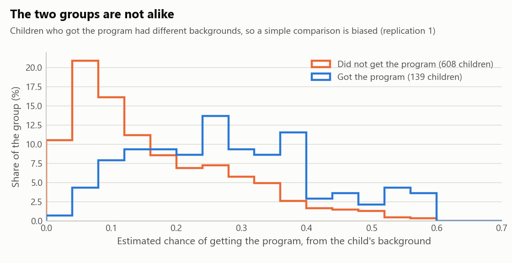
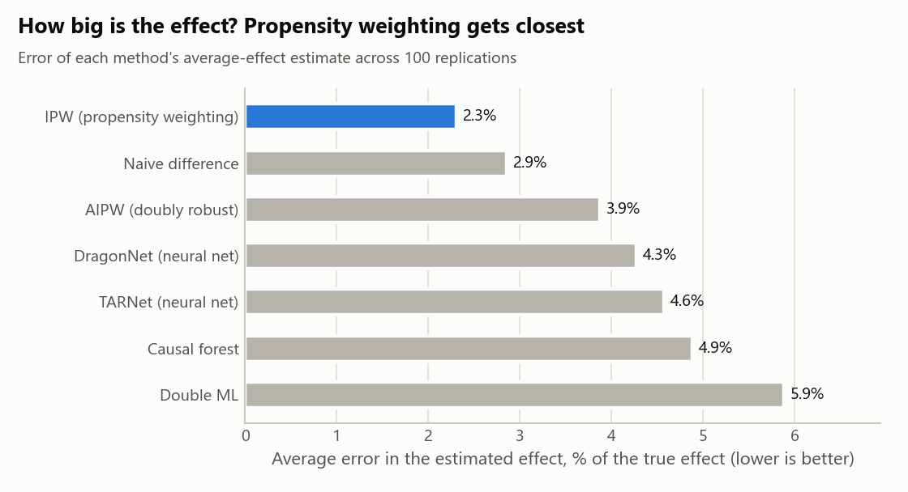
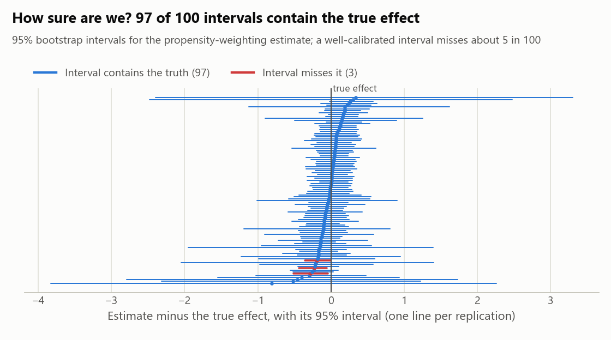
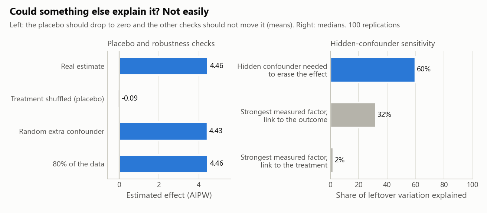
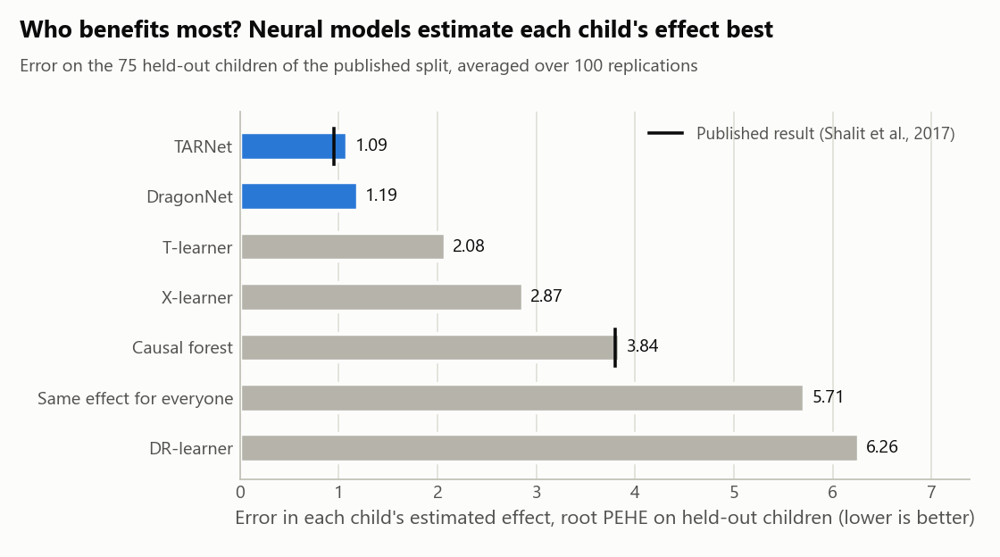
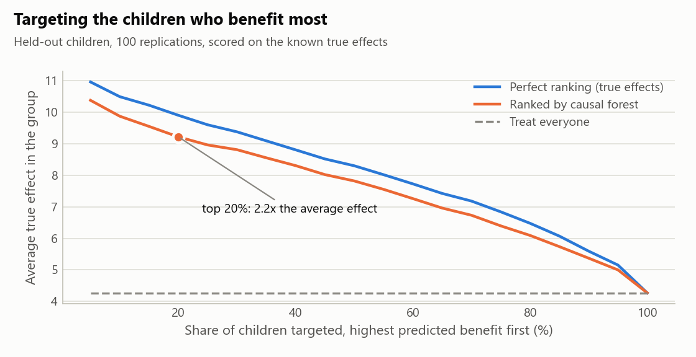

# Causal effects of an infant health program

Did an early-childhood health program help low-birth-weight infants, by how much, and which children gained the most?

This repo answers those questions with causal inference on **IHDP**, a standard semi-synthetic benchmark built from the Infant Health and Development Program. The children and their backgrounds are real; the outcomes are simulated. Because the true answer is known, every estimate below can be checked against it.

| Question | Answer (100 replications) |
|---|---|
| How big is the effect? | Propensity weighting lands within **2.3%** of the true effect on average |
| How sure are we? | **97 of 100** 95% confidence intervals contain the true effect |
| Could a hidden factor explain it? | It would need to explain **60%** of the leftover variation; the strongest measured factor explains 32% |
| Who benefits most? | Targeting the top 20% by predicted benefit gives **2.2x** the average effect |

## The data

747 children, each described by 25 background measures such as birth weight and the mother's age and education. 139 got the program. The benchmark removes a non-random set of treated children, so the two groups differ before the program starts. Comparing their outcomes directly would mix up the program's effect with those background differences.

<picture>
  <source media="(prefers-color-scheme: dark)" srcset="figures/overlap-dark.png">
  
</picture>

## 1. How big is the effect?

Weighting each child by how unusual their group was, given their background (inverse propensity weighting, IPW), removes most of the bias. It beat every heavier method on the average effect, including doubly robust AIPW, double machine learning, causal forests and two neural networks.

<picture>
  <source media="(prefers-color-scheme: dark)" srcset="figures/average_effect_error-dark.png">
  
</picture>

## 2. How sure are we?

A 95% interval should contain the true effect about 95 times in 100. The bootstrap intervals for the IPW estimate did 97 times; AIPW's influence-function intervals also covered 97.

<picture>
  <source media="(prefers-color-scheme: dark)" srcset="figures/confidence_intervals-dark.png">
  
</picture>

## 3. Could something else explain it?

Two kinds of checks. Shuffling who got the program (a placebo) should make the effect vanish, and it does: 4.46 drops to -0.09. Adding a random extra confounder or dropping 20% of the data should not move it, and they don't.

Then a sensitivity analysis (Cinelli and Hazlett, 2020) asks how strong an unmeasured confounder would have to be to erase the effect: it would need to explain 60% of the leftover variation in both the treatment and the outcome, far more than any measured factor. On this benchmark every confounder is measured by construction, so the point is the method, which carries over to real observational health data.

<picture>
  <source media="(prefers-color-scheme: dark)" srcset="figures/robustness-dark.png">
  
</picture>

## 4. Who benefits most?

The effect is not the same for every child. Neural models that share what they learn across the two groups (TARNet, DragonNet) estimate each child's effect best, in line with the published results for this benchmark. The DR-learner does worst: its training targets divide by propensities as small as 0.01, which makes them very noisy with only 139 treated children.

<picture>
  <source media="(prefers-color-scheme: dark)" srcset="figures/per_child_error-dark.png">
  
</picture>

Those per-child estimates are useful even when imperfect. Ranking children by the causal forest's estimate and treating the top 20% gives 2.2x the average effect of treating everyone, 93% of what a perfect ranking would get.

<picture>
  <source media="(prefers-color-scheme: dark)" srcset="figures/targeting-dark.png">
  
</picture>

## How it was done

- **Methods:** naive difference, IPW, AIPW, double ML and causal forests (EconML); T-, X- and DR-learners; TARNet and DragonNet in PyTorch.
- **No tuning on the answer:** every model choice was fixed before looking at any error against the truth.
- **Data:** the standard 100-replication release with the published train/test split (Shalit et al., 2017), so per-child errors compare directly with published tables. A 10-replication run gives the same picture (2.3% error, 1.9x targeting lift).
- **Every number** in this README is in `results/ihdp100/` (100 replications) or `results/` (10), written by the scripts below.

## Serving the model

The per-child model can also score new records: exported to ONNX (matching PyTorch to 2.4e-6), served by FastAPI with a flag for children whose estimates are unreliable because few similar children got the other treatment, and packaged in Docker. ONNX Runtime scores a single child about 4x to 6x faster than PyTorch. Details: `results/bench.md`, `serve/`, `Dockerfile`.

## Run it

```
python -m venv .venv
.venv/Scripts/python -m pip install -r requirements.txt --extra-index-url https://download.pytorch.org/whl/cpu
.venv/Scripts/python run.py --source ihdp100          # classical estimators, targeting, placebo checks
.venv/Scripts/python run_deep.py --source ihdp100     # TARNet and DragonNet
.venv/Scripts/python run_ci.py --source ihdp100       # confidence intervals and coverage
.venv/Scripts/python sensitivity.py --source ihdp100  # hidden-confounder sensitivity
.venv/Scripts/python make_figures.py                  # the figures above
```

Drop `--source ihdp100` for the 10-replication run. For the scoring service: `pip install -r requirements-dev.txt`, `python export.py`, `uvicorn serve.app:app`, or `docker build -t ihdp-cate .`.

## References

- J. L. Hill. Bayesian nonparametric modeling for causal inference. JCGS, 2011.
- U. Shalit, F. Johansson, D. Sontag. Estimating individual treatment effect: generalization bounds and algorithms. ICML, 2017.
- C. Shi, D. Blei, V. Veitch. Adapting neural networks for the estimation of treatment effects. NeurIPS, 2019.
- V. Chernozhukov et al. Double/debiased machine learning for treatment and structural parameters. Econometrics Journal, 2018.
- S. Wager, S. Athey. Estimation and inference of heterogeneous treatment effects using random forests. JASA, 2018.
- C. Cinelli, C. Hazlett. Making sense of sensitivity: extending omitted variable bias. JRSS-B, 2020.
- C. Louizos et al. Causal effect inference with deep latent-variable models (CEVAE). NeurIPS, 2017.
