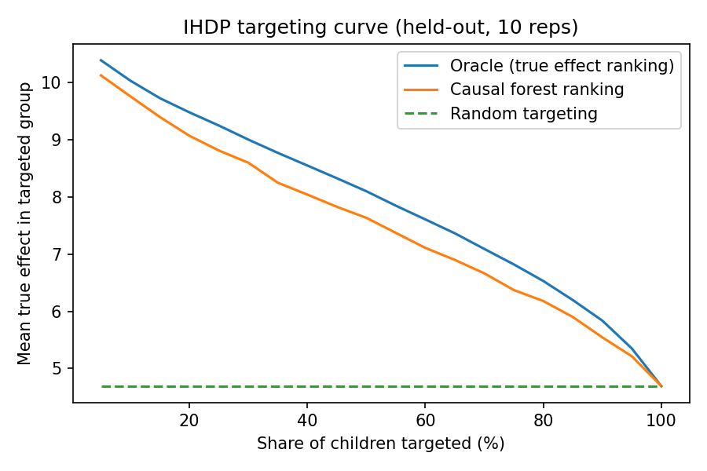

# IHDP: causal effect estimation, from benchmark to production

How well do causal inference methods recover a treatment effect from observational data, when the true answer is known? And what does it take to serve per-person effect estimates in production?

This repo compares classical and deep causal estimators on the IHDP benchmark, then exports the served model to ONNX behind a FastAPI scoring service.

## Dataset

IHDP is a **semi-synthetic** benchmark (Hill, 2011). The covariates come from a real randomized trial of an early-childhood health and development intervention for low-birth-weight infants. Hill made it observational by removing a non-random subset of treated children (18.6% treated remain) and simulated the outcomes, so each child's true effect is known.

This repo uses the 10 replications distributed with CEVAE: 747 children, 6 continuous and 19 binary covariates. `data.py` downloads them into `data/` on first run.

## Protocol

Every model choice was fixed before looking at any error against the ground truth, and nothing was tuned afterwards.

- **Average effect (ATE):** fit on all 747 children, report the absolute error against the true ATE.
- **Per-child effects (CATE):** fit on a 70% split (seed = replication), report root PEHE on the held-out 30%.
- 10 replications, mean with standard error. The true ATE is about 4 in nine replications and 10.5 in replication 9, whose extreme effect surface dominates most averages.

## Classical estimators

| Estimator | What it does |
|---|---|
| Naive difference | Mean outcome of treated minus untreated. Ignores confounding. |
| IPW | Normalized inverse-propensity weighting, logistic propensity clipped to [0.01, 0.99]. |
| AIPW (doubly robust) | Outcome models plus propensity weighting, cross-fitted over 5 folds. |
| Double ML (linear) | EconML `LinearDML`: residualize outcome and treatment, regress one residual on the other. |
| Causal forest | EconML `CausalForestDML`: per-child effects from a generalized random forest. |

Outcome models are gradient-boosted trees (sklearn defaults). Per-child effects are also compared with a T-learner and a constant-effect baseline.

## Results

**Average effect: absolute error**

| Method | Error | SE |
|---|---|---|
| Naive difference | 0.262 | 0.155 |
| IPW | **0.123** | 0.042 |
| AIPW (doubly robust) | 0.195 | 0.039 |
| Double ML (linear) | 0.745 | 0.499 |
| Causal forest | 0.562 | 0.326 |

**Per-child effects: root PEHE on held-out children**

| Method | sqrt PEHE | SE |
|---|---|---|
| Constant effect | 4.756 | 2.829 |
| T-learner | **2.183** | 1.172 |
| Causal forest | 3.284 | 1.921 |

**Targeting.** Ranking held-out children by the causal forest's predicted effect and treating the top 20% gives a mean true effect of 9.07, against 4.69 for treating everyone and 9.48 for a perfect ranking. The curve is scored on the known true effects. It is not a Qini curve: treatment in IHDP is not randomized, so an observed-outcome Qini would be biased.



**Refutations of the AIPW estimate** (mean over replications, written by hand in the style of DoWhy's refuters)

| Test | Result | Expected |
|---|---|---|
| Estimate | 4.611 | |
| Placebo treatment (shuffled) | -0.120 | near 0 |
| Random common cause added | 4.629 | unchanged |
| 80% random subsets | 4.632 | unchanged |

**Takeaways**

- Simple weighting (IPW, AIPW) recovered the average effect best. The heavier models did worst on the average, mostly because of replication 9.
- For per-child effects the T-learner beat the causal forest, and both beat assuming one effect for everyone.
- Even with an imperfect per-child fit, the causal forest's ranking captured most of the gain from targeting (9.07 of an oracle 9.48).

Full numbers: `results/summary.md`, `results/results.json`.

## Deep models

Two neural CATE models in PyTorch, scored with the same protocol:

- **TARNet** (Shalit et al., 2017): a shared representation trunk with one outcome head per arm.
- **DragonNet** (Shi et al., 2019): TARNet plus a propensity head and targeted regularization.

Hyperparameters follow the papers and were fixed up front: trunk 3 x 200 ELU, heads 2 x 100 ELU, Adam lr 1e-3, batch 64, L2 1e-4, early stopping on factual validation loss (20% of training rows). The true effects are never used in training or model selection.

| Method | ATE error | SE | sqrt PEHE | SE |
|---|---|---|---|---|
| TARNet | 0.229 | 0.064 | **1.250** | 0.522 |
| DragonNet | 0.407 | 0.167 | 1.321 | 0.568 |

Both neural models cut the held-out per-child error well below the best classical model (T-learner, 2.183), while the simple weighting estimators remain the most accurate for the average effect.

Full numbers: `results/deep_summary.md`, `results/deep_results.json`.

## Serving

`export.py` trains the serving model and exports it to ONNX with the covariate normalization baked into the graph, so the service takes unnormalized features: x1..x6 as they are, x7..x25 as 0/1. Note that the CEVAE CSV codes x14 as 1/2, so subtract 1 before sending it (this is also in `/metadata`). The export fails unless ONNX Runtime matches PyTorch to within 1e-4 (measured: 2.4e-6).

The service uses DragonNet rather than TARNet. Its propensity head lets the API flag inputs with poor overlap, where any effect estimate is unreliable. TARNet scored slightly better on PEHE, but PEHE needs ground truth that a production system never has, so it is not a selection rule.

`serve/app.py` is a FastAPI service on ONNX Runtime:

| Endpoint | |
|---|---|
| `GET /health` | Liveness and model version |
| `GET /metadata` | Feature order, model hash, parity check |
| `POST /score` | Up to 50,000 rows of 25 features. Returns the predicted effect, propensity, a treat/don't-treat flag at a chosen threshold, and a low-overlap flag (propensity outside [0.05, 0.95]) |

```
curl -X POST localhost:8000/score -H "Content-Type: application/json" \
  -d '{"rows": [[-0.53,-0.34,1.13,0.16,-0.32,1.3,1,0,1,0,0,0,0,0,0,1,1,1,1,0,0,0,0,0,0]], "threshold": 4.0}'
```

Tests (`tests/`) cover the endpoints, input validation and ONNX to PyTorch parity.

```
.venv/Scripts/python -m pip install -r requirements-dev.txt
.venv/Scripts/python export.py                              # writes artifacts/
.venv/Scripts/python -m uvicorn serve.app:app --port 8000
.venv/Scripts/python -m pytest -q
```

### Docker

The image holds only the service: ONNX Runtime, FastAPI and the exported model, with no PyTorch or training code (463 MB, runs as a non-root user).

```
docker build -t ihdp-cate .
docker run -p 8000:8000 ihdp-cate
```

## Benchmarks

`bench.py` times the served model (146k parameters) on an Intel Core Ultra 7 265K CPU, median of repeated runs after warmup.

**In process: PyTorch eager vs ONNX Runtime**

| Batch | PyTorch p50 (ms) | ONNX Runtime p50 (ms) | Speedup | ONNX rows/s |
|---|---|---|---|---|
| 1 | 0.143 | 0.023 | 6.3x | 43,668 |
| 64 | 0.328 | 0.150 | 2.2x | 427,807 |
| 1024 | 1.285 | 0.718 | 1.8x | 1,426,979 |
| 16384 | 11.485 | 9.506 | 1.2x | 1,723,534 |

ONNX Runtime wins most where per-call overhead dominates and the gap closes at very large batches, where both are bound by the same matrix multiplies. Timings on a desktop CPU vary between runs: an earlier run measured 3.8x at batch 1 and 0.9x at batch 16384, so treat the single-row speedup as roughly 4x to 6x.

**End to end over HTTP** (local uvicorn, one worker, one client sending requests one after another, so rows/s is client loop speed, not server capacity)

| Batch | Round trip p50 (ms) | p99 (ms) | Server-side scoring p50 (ms) | rows/s |
|---|---|---|---|---|
| 1 | 1.08 | 2.57 | 0.08 | 922 |
| 1024 | 9.44 | 22.24 | 1.60 | 108,429 |

The same benchmark against the Docker container (Docker Desktop on Windows) measured a 1.45 ms round trip at batch 1 and 15.8 ms at batch 1024, with server-side scoring unchanged (0.07 ms and 1.3 ms). The extra time is most likely Docker Desktop's port forwarding; it was not broken down further.

Server-side scoring is the `latency_ms` the service reports: converting the rows to an array, running the model and converting the outputs back to lists. At batch 1024 that is 1.6 ms of a 9.4 ms round trip. The rest is request validation, JSON encoding on both ends and transport, not broken down further.

```
.venv/Scripts/python bench.py --url http://localhost:8000
```

## Setup

```
python -m venv .venv
.venv/Scripts/python -m pip install -r requirements.txt --extra-index-url https://download.pytorch.org/whl/cpu
.venv/Scripts/python data.py   # downloads the 10 replications into data/
.venv/Scripts/python run.py    # classical estimators, writes results/
.venv/Scripts/python run_deep.py   # TARNet and DragonNet
```

## References

- J. L. Hill. Bayesian nonparametric modeling for causal inference. JCGS, 2011.
- C. Louizos et al. Causal effect inference with deep latent-variable models (CEVAE). NeurIPS, 2017.
- U. Shalit, F. Johansson, D. Sontag. Estimating individual treatment effect: generalization bounds and algorithms. ICML, 2017.
- C. Shi, D. Blei, V. Veitch. Adapting neural networks for the estimation of treatment effects. NeurIPS, 2019.
- V. Chernozhukov et al. Double/debiased machine learning for treatment and structural parameters. Econometrics Journal, 2018.
- S. Wager, S. Athey. Estimation and inference of heterogeneous treatment effects using random forests. JASA, 2018.
